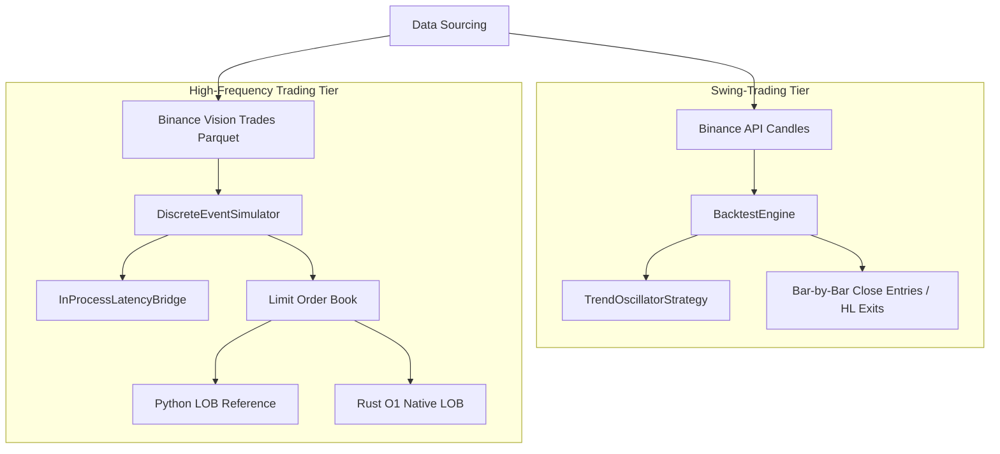

# System Architecture: HFT Discrete Event Simulator & Order Book Core

This document outlines the design and architecture of the two-tier trading backtesting engine implemented in this repository.

---

## 1. Two-Tier Engine Design

The repository supports two distinct tiers of strategy backtesting, catering to different time horizons and execution fidelity:

### Tier 1: Swing-Trading Engine (`BacktestEngine`)
* **Resolution**: Bar level (e.g., 4-hour candles).
* **Fidelity**: Medium. Assumes entries occur at candle closes, and exits (Stop Loss / Take Profit) are checked against intra-bar highs and lows using a conservative sl-first priority assumption on ambiguous candles.
* **Use Case**: Long-to-medium term portfolio optimization, indicator tuning, and momentum/trend strategy testing.

### Tier 2: High-Frequency Trading Engine (`DiscreteEventSimulator`)
* **Resolution**: Nanosecond epoch.
* **Fidelity**: High. Operates as a **Discrete Event Simulator (DES)** using a priority queue (min-heap sorted by timestamp). All events (trades, order book snapshots, trading signals, latency delays, and fills) are processed sequentially in strict chronological order.
* **Use Case**: High-frequency market-making, arbitrage, and latency-sensitive order execution routing.

---

## 2. Limit Order Book (LOB) Architecture

To support tick-level simulation, the engine provides two interchangeable limit order book implementations satisfying `HFTOrderBookProtocol`:

### A. Python LOB Reference (`LimitOrderBook`)
* **Implementation**: Uses `sortedcontainers.SortedDict` for sorted price levels. Price levels are backed by double-ended queues (`collections.deque`).
* **Complexity**:
  * **Add Order**: $O(\log n)$ price level lookup + $O(1)$ queue append.
  * **Cancel Order**: $O(n)$ deque scan.
* **Purpose**: Serves as the ground-truth correctness reference.

### B. Rust Native LOB (`hft_engine.OrderBook`)
* **Implementation**: Built in Rust with PyO3 bindings. Utilizes a `SlotMap` arena to allocate resting orders with stable keys (avoiding pointer invalidation). Maintains a `HashMap` of `order_id -> SlotKey` for $O(1)$ cancels, and `BTreeMap` for sorted price levels. Each level stores a doubly-linked list of SlotKeys.
* **Complexity**:
  * **Add Order**: $O(\log n)$ BTreeMap lookup + $O(1)$ doubly-linked list tail append.
  * **Cancel Order**: $O(1)$ hashmap lookup + $O(1)$ doubly-linked list splice.
* **Purpose**: Performance-optimized native core for high-throughput backtesting.

---

## 3. Latency & Slippage Simulation

High-frequency order routing is subject to network and execution delays. The engine simulates this via `InProcessLatencyBridge`:

1. When a strategy generates a `SignalEvent` at timestamp $t$, it is intercepted by the latency bridge.
2. The bridge wraps the signal and reschedules it as a `LatencyDelayEvent` scheduled at $t + \text{latency\_ns}$.
3. Any market ticks or order book updates that occur in the interval $[t, t + \text{latency\_ns}]$ are processed by the simulator first.
4. When the delayed order is finally submitted at $t + \text{latency\_ns}$, the order book state has changed, naturally producing **slippage** without arbitrary noise parameters.

---

## 4. Validation and Regression Guardrails

* **LOB Equivalence**: Python and Rust LOBs are cross-validated on 10,000 random add/cancel operations to assert identical best bids, best asks, spreads, and execution fills.
* **DES vs Bar Engine Equivalence**: A dedicated integration test converts candle data into synthetic tick sequences (Open $\rightarrow$ Low $\rightarrow$ High $\rightarrow$ Close) and runs the same strategy across both engines, asserting that execution prices, trade counts, and final net PnL match within a 5% tolerance.
* **Regression Safety**: Modifying the core HFT modules preserves compatibility with the original swing-trading optimized research pipeline, validated by running `runner.py`.
